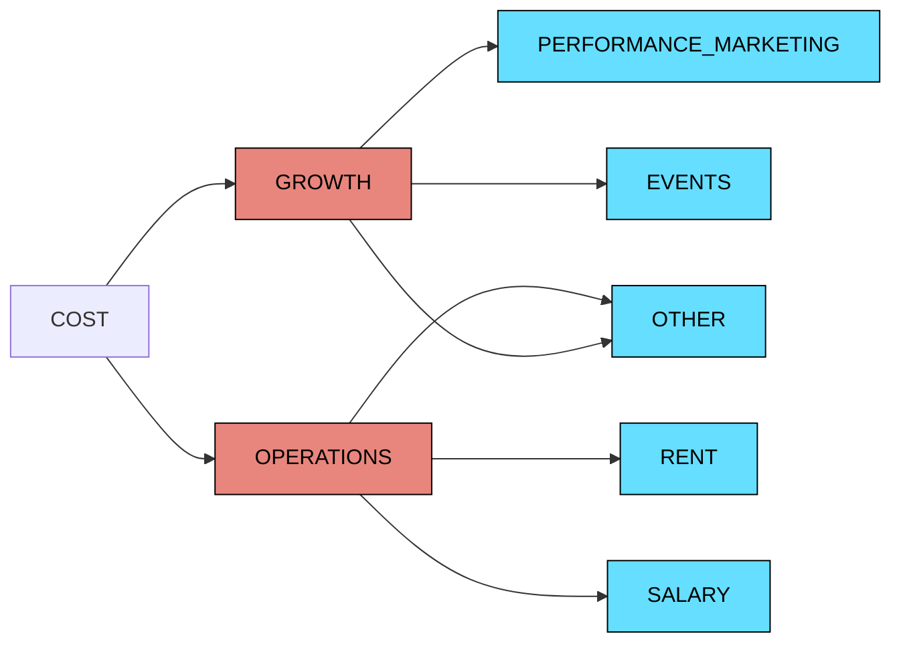

# Cost Model

```mermaid
graph LR
%% Colors %%
classDef blue fill:#66deff,stroke:#000,color:#000
classDef green fill:#6ad98b,stroke:#000,color:#000 
classDef red fill:#e8867d,stroke:#000,color:#000 
  
COST --> GROWTH:::red
	COST --> OPERATIONS:::red
	OPERATIONS --> RENT:::blue
	OPERATIONS --> SALARY:::blue
	OPERATIONS --> OTHER:::blue
	GROWTH --> PERFORMANCE_MARKETING:::blue
	GROWTH --> EVENTS:::blue
GROWTH --> OTHER:::blue

```
