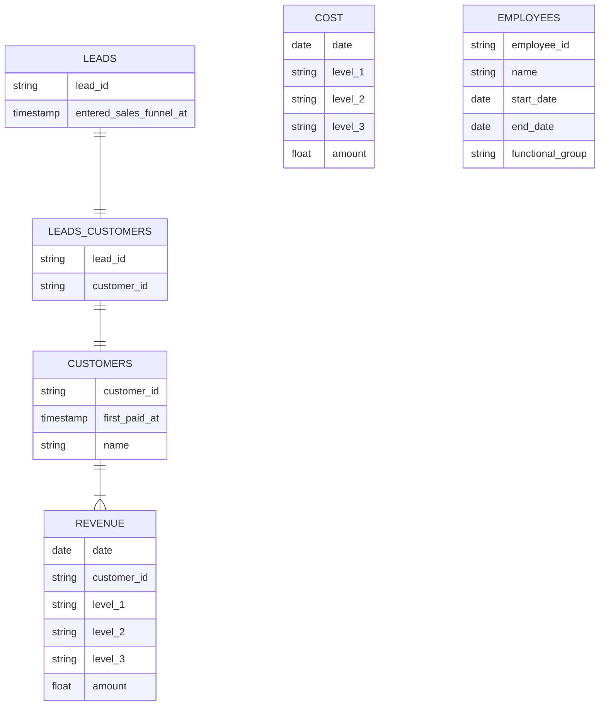

# Entity Relationship Diagram

```mermaid
erDiagram
LEADS {
        string lead_id
        timestamp entered_sales_funnel_at
    }
LEADS_CUSTOMERS{
				string lead_id
				string customer_id
}
CUSTOMERS {
        string customer_id
        timestamp first_paid_at
				string name
    }
REVENUE{
date date	
string customer_id	
string level_1	
string level_2	
string level_3	
float amount	
}
COST{
date date	
string level_1	
string level_2	
string level_3	
float amount	
}
EMPLOYEES{
string employee_id
string name
date start_date	
date end_date
string functional_group
}

%% ER crow's foot notiation: { or } represent many; | represents at least one; and the letter o represents zero or many. the -- connects two entities and the relations they have to each other, with a label:
LEADS||--||LEADS_CUSTOMERS:""
LEADS_CUSTOMERS||--||CUSTOMERS: ""
CUSTOMERS ||--|{ REVENUE : ""

```
